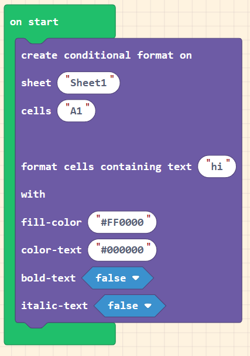

# Intent Example Simple

Demo

1. [Load Make Code Playground](https://makecode.com/playground)
1. Copy contents of [blocks.ts](./blocks.ts)
1. Observe Block 
    
1. Swap to the JavaScript Code View
1. Observe Code
    ```typescript
        intent.createOnWorksheetRangeConditionalFormatContainsText(
    "Sheet1",
    "A1",
    "hi",
    "#FF0000",
    "#000000",
    false,
    false
    )
    ```
1. Swap back to block view, note how the code can translate back to a block
1. Observe how this can be used in and Office Script given output code and definition for the intent block [office-script.ts](./office-script.ts)
1. copy contents of [office-script.ts](./office-script.ts) into a new script in the Automate Editor and click run. 
